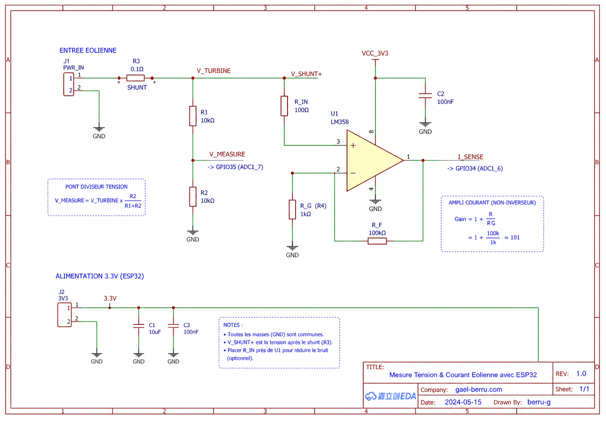

# Projet éolienne

## Matos actuellement validé pour le projet éolienne en cours :

| Composant | Spécification Validée |
| --- | --- |
| Moteur brushless | 2600KV, 12V, 15A, ~180W |
| Contrôleur MPPT | 12V, 20A, compatible LiFePO4 |
| Batterie | 12V (4S), 40Ah, avec BMS 4S 30A |
| Convertisseur | 12V→5V/3A, USB |
| Réducteur | Rapport 1:10 (à confirmer) |
| Sécurité | Fusible 20A, diodes de protection |

## Deuxieme prototype :

| Composant | Modèle | Prix (€) |
| --- | --- | --- |
| Moteur brushless | 48V 500W | 80-150 |
| Contrôleur MPPT | EPEVER 40A | 100-150 |
| BMS 4S | 100A | 20-40 |
| Câbles et connecteurs | Section 10mm² | 10-30 |
| Total |  | 210-370 |


### **1. Objectif Global**
- **Fabriquer une éolienne** utilisant un moteur brushless ou DC pour charger un pack de batteries LiFePO4.
- **Alimenter des appareils** (portables, systèmes 12V) via un convertisseur.

---

### **2. Composants Principaux**

#### **A. Moteur**
- **Pour une petite éolienne (environ 180W)** :
  - Moteur brushless **2600KV** (12V, (15A par deduction a verifier!)).
  - **Réducteur mécanique** nécessaire pour adapter la vitesse (ex : rapport 1:10 a tester en réel!).
- **Pour un pack 4S 100Ah** :
  - Moteur **brushless 48V, 500W-1000W** (ex : [moteur éolienne DIY](https://fr.aliexpress.com/item/1005004123456789.html)).
  - **Avantage** : Rendement élevé, compatible avec les contrôleurs MPPT modernes.

#### **B. Contrôleur MPPT**
- **Pour 180W (12V)** :
  - Contrôleur MPPT **12V/20A** (ex : EPEVER 20A).
- **Pour 4S 100Ah (14,6V)** :
  - Contrôleur MPPT **40A-50A**, tension d’entrée jusqu’à 100V (ex : EPEVER 40A).
  - **Modèles recommandés** :
    - [EPEVER MPPT 40A](https://fr.aliexpress.com/item/1005003721456789.html)
    - [Victron SmartSolar 30A](https://www.victronenergy.fr/)

#### **C. Batterie LiFePO4**
- **Configuration 4S** :
  - 4 cellules **3,2V 100Ah** en série → **12,8V 100Ah**.  (pour 2600Kv = 12V (4S), 40Ah, avec BMS 4S 30A )
  - **Tension max** : 14,6V.
  - **BMS** : [BMS 4S 100A](https://fr.aliexpress.com/item/1005003998420010.html).

#### **D. Convertisseur**
- **12V→5V USB** :
  - Convertisseur buck **12V→5V/3A** (pour portables).
- **12V→220V** (optionnel) :
  - Onduleur **300W-500W** (pour appareils 220V).

---

### **3. Schémas de Branchement**

#### **A. Éolienne 180W (12V)**
```
[Éolienne]
       │
       ▼
[Moteur Brushless 12V 2600KV + Réducteur]
       │
       ▼
[Contrôleur MPPT 12V/20A]
       │
       ▼
[Batterie LiFePO4 12V 40Ah + BMS]
       │
       ▼
[Convertisseur 12V→5V USB]
```

#### **B. Éolienne 500W-1000W (48V→14,6V)**
```
[Éolienne]
       │
       ▼
[Moteur Brushless 48V 500W]
       │
       ▼
[Contrôleur MPPT 48V→14,6V 40A]
       │
       ▼
[BMS 4S 100A]
       │
       ▼
[Pack 4S LiFePO4 100Ah]
       │
       ▼
[Convertisseur 12V→5V/220V]
```

---

### **4. Calculs et Vérifications**
- **Puissance du moteur** :
  - \( P = U \times I \) (ex : 12V × 15A = 180W).
- **Courant de charge** :
  - Pour 100Ah, courant recommandé : **20A-30A** (0,2C-0,3C).
- **Tension de charge** :
  - LiFePO4 4S : **14,6V max**.

---

### **5. Sécurité et Tests**
- **Protection** :
  - Fusibles sur les lignes moteur → contrôleur et contrôleur → batterie.
  - Diodes anti-retour pour éviter les décharges inverses.
- **Tests** :
  - Mesurer la tension/courant générés par le moteur en rotation.
  - Vérifier la température des composants après 30 min de fonctionnement.

---

### **6. Budget Estimé**
| Projet               | Composant               | Modèle                  | Prix (€)  |
|----------------------|-------------------------|-------------------------|-----------|
| Éolienne 180W        | Moteur 12V              | Brushless 2600KV        | 30-80     |
|                      | Contrôleur MPPT         | 12V/20A                 | 40-80     |
|                      | Batterie 12V 40Ah       | LiFePO4 + BMS           | 200-300   |
| Éolienne 500W-1000W  | Moteur 48V              | Brushless 500W          | 80-150    |
|                      | Contrôleur MPPT         | 40A (EPEVER)            | 100-150   |
|                      | Batterie 12,8V 100Ah    | LiFePO4 4S + BMS 100A   | 600-900   |

---

## Mesurer la puissance générée par le moteur :

Fabriquer un multimetre avec esp32 et envoyer les données sur mon server mamp pour les afficher sur une page php.




### **7. Prochaines Étapes**
1. **Finaliser le choix des composants** (moteur, MPPT, BMS).
2. **Commander les pièces** (liens fournis).
3. **Assembler et tester** :
   - Vérifier la tension/courant générés par le moteur.
   - Configurer le contrôleur MPPT pour LiFePO4.
4. **Optimiser** :
   - Ajuster le réducteur pour maximiser la puissance.
   - Protéger le système contre les intempéries.

---

### **8. Ressources Utiles**
- **Achat de composants** :
  - [AliExpress](https://fr.aliexpress.com/)
  - [Amazon](https://www.amazon.fr/)
- **Tutoriels** :
  - [DIY Wind Turbine](https://www.instructables.com/How-to-Build-a-Wind-Turbine/)
  - [MPPT Controller Setup](https://www.youtube.com/watch?v=example)

